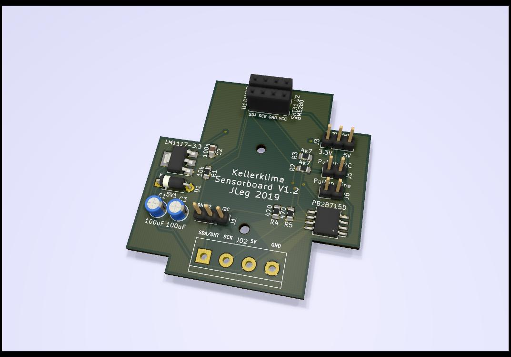
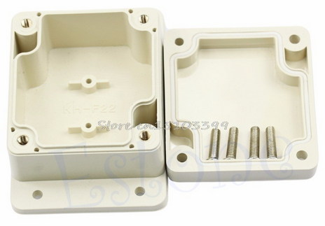
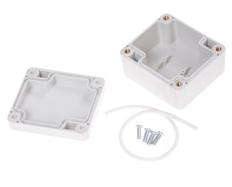

# Kellerklima
## Arduino-based humidity controller with indoor and outdoor sensors for fan control

I made this device to dry my (and others :) cellars by mostly making use of the times when the absolute humidity outdoors is lower than indoors. 
For this, two sensors are used to measure humidity and temperature, indoors and outdoors.
Though this seems to be quite a common design, i only found some rather costly commercial products. This one mostly uses cheap and popular modules.

## Basic principle
Temperature and humidity values from inside and outside are used to calculate the absolute humidity. If the outside is less humid than the inside, the fan is started (or, alternatively, the window is opened, if an opener is used instead of a fan).
There's a maximum fan runtime to be configured. After this time, either the fan is paused, or - using the 2nd relay - a dehumidifier unit can be started for a set period of time.
This repeats until the target humidity value for the inside is reached, or one of the user-defined criterias change:
* only runs if the inside humidity is above the trigger value
* only runs if inside temperature is above a minimum value
* only runs if outside temperature is above a minimum value
* only runs if the runtime limit per day (24h) is not reached yet

## Implementation

The rugulation makes use of configurable hysteresis values for activation and deactivation, to avoid "flicker" and a fan being turned on and off too quickly.
All parameters can be configures using the rotary encoder and a menu system with the 1602 LCD. 
Optionally, if an ESP-01 module with ESP-Link (https://github.com/jeelabs/esp-link) is added, the data can also be sent to Thingspeak (you have to define your API key in the code). 
This ESP-01 module also allows to remotely flash the arduino code of the controller, and to monitor all activities of the control box remotely. Parameters can be defined using simple commands, and also fan or dehumidifier can be switched on and off, overriding the regulation.
Libraries used are commented in the code.

Update: It turned out that the DHT22 sensors are cr*p, they "wear out" quite quickly, showing wrong humidity data after a few weeks.
To be able to make use of better quality I2C sensors like BME280 or SHT31, i added an I2C booster/bus driver IC to allow for the long(er) wires i needed. For me, 10m do work just fine with SHT31, there are reports that up to 100m are possible, too.
Additionally, i did not manage to get the SLIP protocol running reliably using the ESP-Link, but i still regard this as useful, since the arduino not only can be flashed "OTA" using ESP-link, the new version also allows to monitor the arduino's activities using EPS-link's "µC Console", and the whole thing can be controlled remotely using a set of commands to set temperatures and other parameters. 
Next hardware revision should probably use an ESP module as controller... 

# Gallery

box in normal run mode; the LCD is switched off after a few minutes of inactivity

rotary encoder at the right - is used to scroll through values, testing the relay, and to set most parameters

PCB version finally ready (V1.2)

new PCB for sensors - tailored to fit into cheap waterproof boxes (65X58X35mm)

like these

